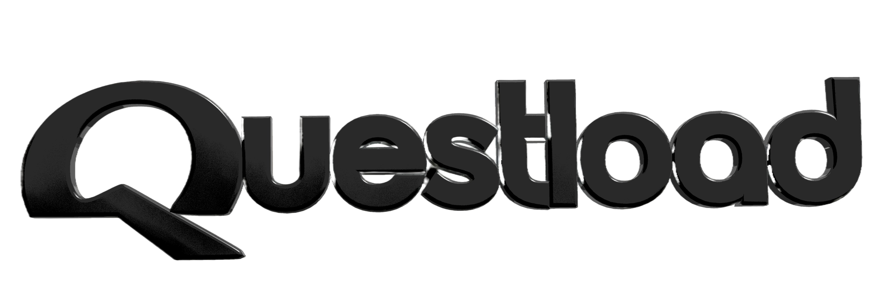
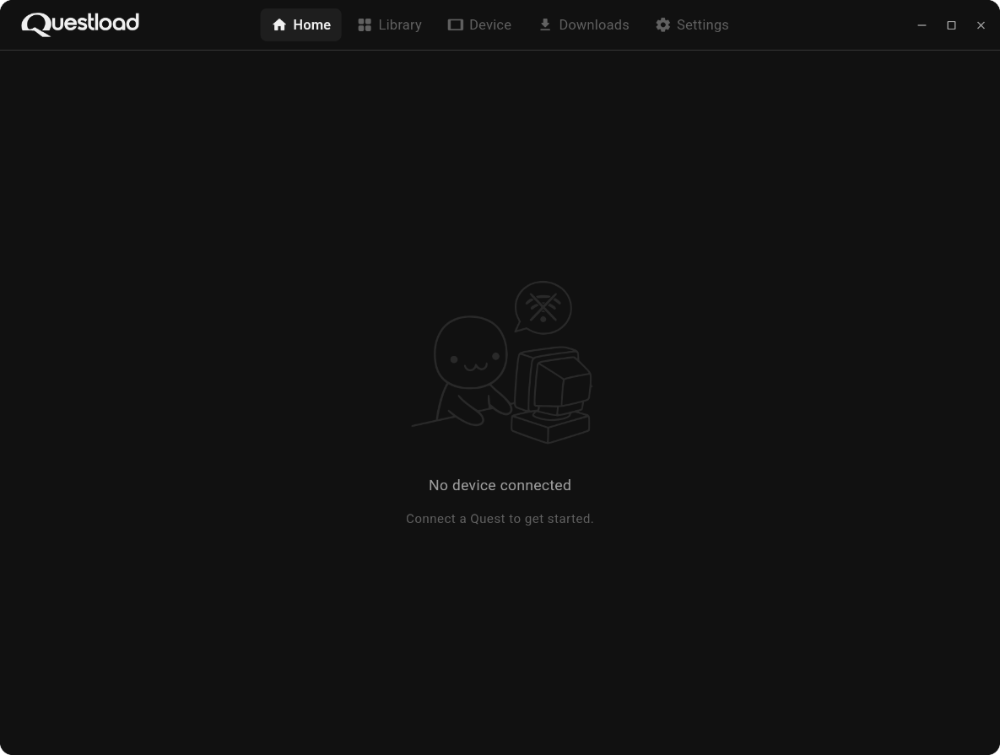

  

A desktop app to manage your Meta Quest device.

  

### Why?
I'm a user, just like you. Tried to give the best experience to myself, and everyone. Questload binary is about 20~ MB itself. I don't use caching on your files. When you delete it, everything is gone. No heavy 1GB electron, no laggy UI parts, no complex UX. Since **apprenticeVr** came out, i had this idea on my head. Questload started its life as a rust project actually, you can learn the whole process on the website. Thanks for being interested on Questload.

### Features

- USB & Wi-Fi ADB connection
- Install / uninstall apps
- mDNS auto-discovery
- File manager for on-device storage

### License

> Questload uses GPL-3.0 — Every copy of it must have source code on the internet. 
